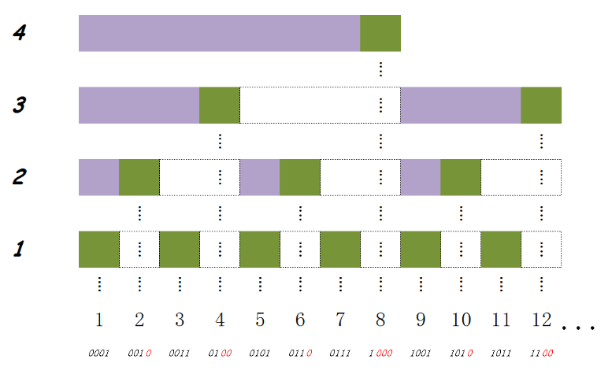

# C++ STL&Algorithms

## 优先队列

* empty(), pop(), push(), size(), top()
* 默认优先队列中，优先级最高的先出队
* list container 不能实现queue，可用vector、deque
* http://www.cplusplus.com/reference/queue/priority_queue/priority_queue/

```c++
#include <queue>
#include <functional>//for greater
priority_queue<int/string> q;//从大到小出队
priority_queue<int, vector<int>, greater<int> > q;//从小到大出队
priority_queue<int, vector<int>, less<int> > q;//大到小
//自定义cmp优先级
struct cmp {
	bool operator () (int x, int y) {
		return x > y;//最小值优先
	}
}
priority_queue<int, vector<int>, cmp> q;
//结构内重载比较运算符，自定优先级
struct node {
	int x;
    bool operator < (const node &a) const {
        return x < a.x//最大值优先
    }
}
priority_queue<node> q;
```

## Map

* map中按照key升序排列，不可以使用sort

```c++
//插入
M.insert(pair<int, string>(12,"asd"));
M.insert(make_pair(12,"asd"));
M.insert(map<int, string>::value_type(12,"asd"));
M[12] = "asd";
```

* 查找find返回iterator,未找到返回.end()
* 遍历操作

```c++
//正反迭代器+数组遍历
for(int i = 1; i <= M.size(); i++)
  cout << M[i] << endl;
```

* 利用数组下标形式新建修改item

```c++
map<int, float> res;
res[1] += 10;// insert <1,10>
res[1] += 10;// alter <1,20>
res[3];// insert <3,0>
cout << res[2] << endl;// res[2] = 0
cout << res.size();// size is three
```

## Set

* set中元素默认升序排列

## Disjoint Set

* 数组或者链表实现

```c++
vector<int> DS(N);// init DS(N, -1)；初始化中也可以让根部指向自己
int cnt;// # of disjoint set
void init() {
  cnt = N;
  fiil(DS.begin(), DS.end(), -1);
}
// 路径压缩
int find(int x) {
  if(DS[x] < 0) return x;
  return DS[x] = find(DS[x]);
}
// Union by Height，也可以是其他标准，目的是减少高度，尽量平衡
// 此处的高度为一个上界，是高度的负值再减1，储存在DS[root]中
void union_by_H(int a, int b) {
  int r1 = find(a);
  int r2 = find(b);
  if(r1==r2) return;
  if(DS[r2] < DS[r1]) //r2 is deeper
    DS[r1] = r2;
  else {
    if(DS[r1] == DS[r2]) 
      DS[r1]--;
   	DS[r2] = r1;
  }
  cnt--;//集合个数减一
}
```

## 字符串分词

```c++
#include <iostream>
#include <string>
#include <sstream>
using namespace std;
int main() {
  	stringstream str("abcd efg kk dd ");
  	string tok;
  	while(getline(str, tok, ' ')) {
    		cout << tok << endl;
  	}
  	return 0;
}
```

* stringstream的拷贝构造可以是string、char*

## [BIT树状数组](https://blog.csdn.net/flushhip/article/details/79165701)

* https://www.liuchuo.net/archives/2268 区间更新，单点查询，**未理解**
* 查询和更新的复杂度都是$O(logn)$
* 以二进制的规律分组储存数组的和，从而保存数组，并维持一个较高的操作效率
* c[i]储存从第i个元素向前lowbit(i)个数的和，包括array[i]，c[i]覆盖的长度是lowbit(i)
* BIT数组的下标必须从1开始



* lowbit函数

  * 求某一个数的二进制表示中最低的一位1

  * 也可以理解为：能整除x的最大的2的幂次

    ```c++
    #define lowbit(i) ((i) & (-i))
    ```

#### 单点更新，区间查询

* 查询前缀和

  ```c++	
  int getsum(int pos) {
    int sum = 0;
    for( ; x >= 1; sum += c[pos], pos -= lowbit(pos));//判断写成x > 0也是一样的
    return sum;
  }
  ```

* 更新后缀和c[i]

  更新相当于在原数组上pos位置增加了val，进而数组C中包含了pos位置的值都要更新

  ```c++
  void update(int pos, int deta) {
    for( ; pos <= n; c[pos] += deta, pos += lowbit(pos));
  }
  ```

* 如果要求[x, y]之内的数的和，可以转换成```getsum(y) – getsum(x – 1)```来解决

#### 统计序列中在元素左边比该元素小的元素的个数

```c++
#define lowbit(i) ((i) & (-i))
const int maxn = 10000;
int c[maxn], n;
int getsum(int pos) {
    int sum = 0;
    for( ; pos > 0; sum += c[pos], pos -= lowbit(pos));
    return sum;
}
void update(int pos, int val) {
    for( ; pos <= maxn; c[pos] += val, pos += lowbit(pos));
}
int main() {
    int x;
    scanf("%d", &n);
    for(int i = 0; i < n; i++) {
        scanf("%d", &x);
        update(x, 1);
        printf("%d\n", getsum(x - 1));
    }
    return 0;
}
```

#### 如果给定一个二维数组矩阵A，将循环改成两重

```c++
int c[maxn][maxn]
int getsum(int x, int y) {
		int sum = 0;
		for(int i = x; i >= 1; i -= lowbit(i))
				for(int j = y; j >= 1; j -= lowbit(j))
						sum += c[i][j];
		return sum;
}
void update(int x, int y, int val) {
		for(; x <= n; x += lowbit(x))
			for(; y <= n; y += lowbit(y))
				c[i][j] += val;
}
```

## [stoi函数](http://www.cplusplus.com/reference/string/stoi/)

```c++
int stoi (const string&  str, size_t* idx = 0, int base = 10);
```

### Parameters

- str

  String object with the representation of an integral number.

- idx

  Pointer to an object of type [size_t](http://www.cplusplus.com/size_t), whose value is set by the function to position of the next character in *str* after the numerical value. This parameter can also be a null pointer, in which case it is not used.

- base

  Numerical base (radix) that determines the valid characters and their interpretation. If this is `0`, the base used is determined by the format in the sequence (see [strtol](http://www.cplusplus.com/strtol) for details). Notice that by default this argument is `10`, not `0`.
```C++
// stoi example
#include <iostream>   // std::cout
#include <string>     // std::string, std::stoi

int main ()
{
  std::string str_dec = "2001, A Space Odyssey";
  std::string str_hex = "40c3";
  std::string str_bin = "-10010110001";
  std::string str_auto = "0x7f";

  std::string::size_type sz;   // alias of size_t

  int i_dec = std::stoi (str_dec,&sz);
  int i_hex = std::stoi (str_hex,nullptr,16);
  int i_bin = std::stoi (str_bin,nullptr,2);
  int i_auto = std::stoi (str_auto,nullptr,0);

  std::cout << str_dec << ": " << i_dec << " and [" << str_dec.substr(sz) << "]\n";
  std::cout << str_hex << ": " << i_hex << '\n';
  std::cout << str_bin << ": " << i_bin << '\n';
  std::cout << str_auto << ": " << i_auto << '\n';

  return 0;
}
```

`2001, A Space Odyssey: 2001 and [, A Space Odyssey]`

`40c3:  16579`

`-10010110001: -12010`

`x7f: 127`

## [make_heap、pop_heap、push_heap](http://www.cplusplus.com/reference/algorithm/push_heap/)

* 默认最大堆

```C++
make_heap(v.begin(), v.begin() + 4);// [0,4)的数据构成heap，其余数据不变
push_heap(v.begin(), v.begin() + 6);// [0,6)的将位于5、6的数据加入，构成heap
pop_heap(v.begin(), v.begin() + 6);// 将根元素放置heap范围的末尾，构成堆的范围-1，变成了[0,5)
//这三个函数都能自定义比较函数，来自定义顺序
// define cmp function
auto cmp = [](const int x, const int y) { return x > y;};
make_heap(v.begin(), v.end(), greater<int>());//最小堆
```

