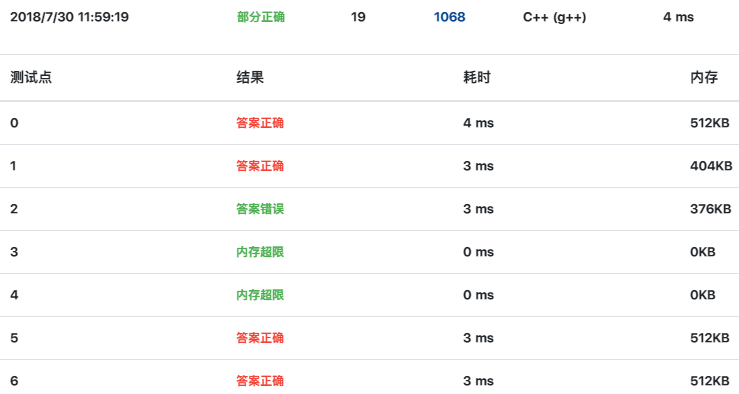
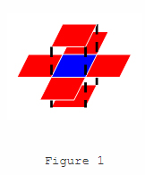
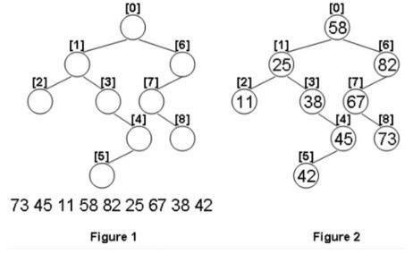

# PAT Advanced Level

* TODO:
  * 1026 re-define data structure
  * 1034 ...
  * LC subString & LC subSequence 总结
  * 1039 学姐的做法
  * 1047 problem???
  * 1098学姐的做法？
  * 1114找不到bug...
  * 树的遍历顺序之间的关系总结
    * 有两种写法
      * 计算根下标：1020、1086学姐的做法
      * 交换元素，1086我的做法
  * 01背包问题总结
* Goal: ALL AC

## 1001(字符串处理)

* string operation using insert

* insert function cannot accept *reverse_iterator*

  * reverse the whole string, then do it as normal 

  * convert *reverse_it* to *it* (***not try, maybe not work***)

    ```c++
    str.insert(r_iter.base(), 1, ',');
    ```

* for each iteration, we should update iterator

  ```c++
  iter = str.insert(iter, ',');
  ```

* http://www.cplusplus.com/reference/string/string/insert/

## 1002(两路merge)

* two-way merge

## 1003(Dijkstra算法 点带权)

* my code using priority queue 22/25

* using Dij Algorithm to find shortest path

* using priority queue to find vertex to visit

  * before push into queue, we need to find if the id in queue

  * self-defined cmp function for determining priority

    ```c++
    struct mycmp {
        bool operator()(int i, int j) {
            return s_dist[i] > s_dist[j];
        }
    };
    ```

* code from https://www.liuchuo.net/archives/2359 AC

* using vector<vector<int\>>  store path

  ```c++
  if(s_dist[curr] + dist[curr][i] < s_dist[i]) {
      s_dist[i] = s_dist[curr] + dist[curr][i];
      team_cnt[i] = team_cnt[curr] + teams[i];
      path_cnt[i] = path_cnt[curr];
      path[i].clear();
      path[i].push_back(curr);
  }
  else if(s_dist[curr] + dist[curr][i] == s_dist[i]) {
      if(team_cnt[i] < teams[i] + team_cnt[curr])
        	team_cnt[i] = teams[i] + team_cnt[curr];
      path_cnt[i] += path_cnt[curr];
      path[i].push_back(curr);
  }
  ```

  

## 1004(DFS, BFS, 层序遍历)

* simple DFS

* using map to represent tree

* Idea from https://blog.csdn.net/iaccepted/article/details/21289205

* can be done by BFS

  * need to record level info. when input

    ```c++
    level[sid] = level[id] + 1;
    ```


## 1005(字符串处理)

* string operation

## 1006(模拟，优先队列应用)

* using map&priority_queue

## 1007(DP，最大连续子序列之和)

* online algorithm O(N)

```c++
else if(curr_sum > max_sum || (curr_sum == 0 && end == N - 1)) {
    ...
}
```

* **curr_sum == 0 && end == N - 1** is very important, for input as below:

  ```shell
  >6
  >0 0 0 0 -1 0
  ```

  If this condition is omitted, the *end* is 5(that is N -1), which is incorrect.

## 1008(数学问题)

* simple

## 1009(模拟，map应用)

* using map

## 1010(二分法)

* simple ***for*** iteration cannot pass test point 7(large sum and out of time)

* binary search must consider N2_d < 0

  This situation happens when N1_d is very large, when computing N2_d, N2_d may exceeding the upper bound and become negative.(e.g. ***right*** is super large , so ***mid*** is also super large, calculate ***pow()*** can be super super large)

```c++
if(N2_d > N1_d || N2_d < 0) break;
...
else if(N2_d > N1_d || N2_d < 0) right = mid - 1;
...
```

* idea from https://www.cnblogs.com/weedboy/p/7244819.html

## 1011(查找元素，优先队列应用)

* priority queue

## 1012(排序)

* sort grades rather than sort ID
* 88 87 87 55，the rank is 1,2,2,4

## 1013(图的遍历，统计连通分量的个数，DFS，Disjoint Set)

* Find the # of sub-connected component连通分量的个数
* DFS or BFS

## 1014(queue应用，模拟)

* defining a good data structure is vital important.

## 1015(素数，计算reverse number)

* is_prime

  ```c++
  bool is_prime(long x) {
      if(x < 2) return false;
      if(x == 2 || x == 3) return true;
      for(long i = 2; i*i <= x; i++) {
          if(x % i == 0) return false;
      }
      return true;
  }
  ```

* calculate reverse number

## 1016(排序)

* a good data structure
* understanding ***no two records for the same customer have the same time***, 所以按时间排序后，offline时间和它正前方的online时间一定是一对

## 1017(queue的应用，模拟)

* the same as 1014

## 1018(Dijstra 算法，DFS搜索最优路径，点带权，判定方法不同，多路径储存)

* test 7 not pass
* 思路和1003类似，但是更正确的做法是储存路径，最后模拟找到最优路径，因为该问题不满足最优子结构
* 但是我的方法只有test 7没过呀
* AC code https://www.liuchuo.net/archives/2373

## 1019(回文数，字符串处理)

* simple

## 1020(树的遍历，之间的转换)

* the relationship between three traversal order
* 后续和中序构建层序

## 1021(图的遍历，DFS，计算连通分量的个数，Disjoint set)

* 通过DFS和Disjoint set都可判断连通分量的个数

* 而找到最深根有非常tricky的做法, 不用对每个节点DFS计算深度

  > **先从一个结点dfs后保留最高高度拥有的结点们，然后从这些结点中的其中任意一个开始dfs得到最高高度的结点们，这两个结点集合的并集就是所求** 

* Idea from https://www.liuchuo.net/archives/2348

## 1022(map应用)

* map的简单应用
* 对于连续getline(cin, s)操作,s是string
  * 连续getline()操作之前一定要getchar()吃掉回车
  * 连续getline()操作之间没有其他输入输出则不用getchar()
  * 连续getline()操作之间有cout/printf输出'\n'，则不用getchar()

## 1023(大整数运算，字符串操作)

* 大整数运算，通过string以及字符操作来实现

* 判断方法tricky

  ```c++
  sort(origin.begin(), origin.end());
  sort(res_copy.begin(), res_copy.end());
  if(res_copy == origin) //Yes
  ```

## 1024(大整数运算，字符串实现)

* 大整数运算，通过string以及字符操作来实现

## 1025(排序)

* Test 3 timeout可能原因是使用map映射id和各种信息，红黑树查找需要时间，不如vector直接快

## 1026(模拟，queue应用，数据结构设计)

* TODO: re-define data structure, and simulate the queueing

## 1027(进制转换)

* easy

## 1028(排序)

* scanf&printf is faster

## 1029(排序，边读边排)

* 第一个队列存好后，把第二个队列边读，边和第一个队列比较，选择出队。这样可以不用一次存完第二个队列，解决超内存的问题.
* Idea from https://www.liuchuo.net/archives/2248

## 1030(Dijkstra算法 + DFS，最短路径，边带权)

* vector\<int> path储存前驱

## 1031(字符串操作，数学问题)

* $2x+y-2=N\to x = \frac{N+2-y}{2}$, 目的是为了$y-x$大于0且最小，$y-x=\frac{3y-N-2}{2}$只能等于$i,i\in\{0,1,2,..\}$，遍历i，解得y即可

## 1032(数组形式链表)

## 1033(贪心)

## 1034

## 1035(字符串操作)

* while((c = getchar()) != '\n')

## 1036(排序、查找)

* online 边读边比较

## 1037(排序，求和)

* 忽略0

## 1038(贪心？字符串比较)

* cmp: return a + b < b + a
* 满足最优子结构

## 1039(映射，大数据查找)

* 简单map会超时，改用vector执行映射，首先要建立ID与下标的关系——getid()
* getid()中pow函数会降低效率...

## 1040(DP最长公共子串LC-Substring)

* TODO：LC substring & LC subsequence

* 转移方程

  $C[i][j] = C[i == 0?0:i-1][j ==0?0:j-1] + 1\quad when\quad s1[i]==s2[j]$

  $C[i][j] = 0\quad when \quad s1[i]\neq s2[j]$

## 1041(queue应用，Hash散列)

* 第一次见到的入队，出现过两次以上的标记为seen，再从队列顶部查看，如果seen，则出队，找到第一个非seen标记即为所求
* TODO：理解此方法https://www.liuchuo.net/archives/2139

## 1042(排序)

* 计算最终的位置即可

## 1043(树遍历以及之间的关系)

* 通过前序构建后序，并通过结构判断是否是BST

## 1044(二分法，查找)

* 遍历起始下标i，找到最小的j，使得i-j的总价钱是正好>=M
* 通过二分加速
* 储存diamond方式与1046类似，降低空间复杂度

## 1045(LC-Subsequence)


* 此题是LCS的变体，在保持顺序的前提下，允许重复

  $C[i][j] = max(C[i][j-1], C[i-1][j])\quad when\quad s1[i] \neq s2[j]$

  $C[i][j] = max(C[i][j-1], C[i-1][j])+1\quad when\quad s1[i] = s2[j]$

## 1046(模拟，online边读入边计算)

* 只需要储存某一个定点到其他所有点的距离，任意两点的距离都是abs(定点到这两点的距离之差)
  * 注意顺序储存
* 最后比较这个距离和另一条路的距离(环路总距离 - 一条路的距离)

## 1047(1039的逆过程，大数据查找)

* TODO：test3 not AC

## 1048(查找，二分查找)

* 调用binary_search

## 1049(数学问题)

* now表示当前位，left表示当前位左边所有数字构成的数字，right表示当前位右边所有数字构成的数字，用a表示now对应的位制，a=1说明now在个位，a=10说明now在十位
  * 如果now是0：会产生left*a个1，因为只有在left从0\~left-1的时候产生1，所以产生了left个，又因为右边会重复a次（0\~a-1）
  * 如果now是1：要比上一种情况多产生 当now为1时，right从0\~right所增加的right+1个1
  * 如果now大于1：会产生(left+1)*a个1，因为只有在left从0\~left的时候产生1，所以产生了left个，又因为右边会重复a次（0\~a-1）
* now从最低位到最高位依次迭代

## 1050(字符操作，字符串操作)

* 可见字符共95个，算上' '(空格)
* gets()为啥编译错误

## 1051(栈模拟，出栈序列判断)

* 方法一：从最先出栈的元素开始遍历
  * 当前出栈元素位A，所有在A后面出栈并且小于A的元素必须从大到小
  * 连续从大到小出栈的个数不能超过栈大小
* 方法二：模拟入栈出栈过程
  * 保存输入的序列到数组
  * 顺序将1\~n进栈
    * 如果大小超过栈大小，break
    * 设current = 1，从保存数组的第一个数字开始，判断是否与栈顶元素相等，相等则出栈current++，不相等就继续按顺序把数字压入栈

## 1052(链表)

* 不在链表中要去除
* 链表为空输出0 -1
* 通过map或者vector映射链表，vector所需空间大

## 1053(树遍历，DFS)

* 先对儿子节点按照权排序，之后顺序遍历即可

## 1054(map的应用)

* map：$color\mapsto 出现的次数$

## 1056(模拟，排序，priority_queue)

* seq数组储存每一轮的出场顺序，符合下一轮条件的push_back到末尾，最后删出原来所有的元素，进入下一轮
* 通过priority_queue选出小组中最大的下标

## 1057(BIT树状数组)

* c[x]表示$\le x $的数出现的个数

* 求第k = (S.size() + 1)/2大的数，就是求从小到大的第K个数，即查找第一个x，使得小于等于x的数的个数等于K

  * 二分法加速

    ```c++
    int PeekMedian() {
        int left = 1, right = maxn, mid, k = (s.size() + 1) / 2;
        while(left < right) {
            mid = (left + right) / 2;
            if(getsum(mid) >= k)
                right = mid;
            else left = mid + 1;
        }
        return left;
    }
    ```

## 1058(进制转换)

* long long
* Galleon的base取LLONG_MAX

## 1059(生成素数表)

* prime_tab

  ```C++	
  #define RANGE 500000
  for(long i = 2; i*i < RANGE; i++) 
          for(long j = 2; j*i <= RANGE; j++) 
                  prime_tab[j*i] = false;
  fill(prime_tab.begin(), prime_tab.begin() + 2, false);
  ```

## 1060(科学计数)

* 字符串处理
* 找到第一个非零数字位置和小数点的位置（无小数点，则小数点位置默认在数末尾），两者之差就是幂指数

## 1061(字符串处理)

* easy

## 1062(排序)

* priority_queue重载<号
* 或者vector排序，自定cmp函数

## 1063(Set应用)

* 简单查找

## 1064(完全二叉树，CBT)

* 具有唯一性
* 根据已排序的节点，节点个数为N，找到根的下标
  * 计算相同高度的“半满完全二叉树”的节点数 bound= (upper+low) / 2，upper和low是相邻两完美二叉树的节点数
  * 若大于bound，则第upper/2 + 1个节点就是根
  * 若小于等于bound，则第N - low/2个节点就是根
  * 递归进行
* 根与儿子在level序遍历中下标的关系
  * left = root*2+1
  * right = root*2+2

## 1065(大数相加，判断越界)

* MAX + MAX = -2
* MIN + MIN= 0

## 1066(AVL tree)

* 核心函数
  * get_height(Node* root)
  * Insert(Node *root, int key)
  * RR(Node *root)、LL(Node *root)、LR(Node *root)、RL(Node *root)

## 1067(模拟，贪心)

* 记录数字i在输入中的下标pos[i]，即i保存在pos[i]的位置
* 输入时，用cnt记录没有在对应位置的数的个数，cnt就为**迭代次数**
* 0不在0位，如果在pos[0]位，该位置本应该是数pos[0]，而数pos[0]的位置在pos[pos[0]]，将这两个位置交换
* 0在0位，当前序列不是有序的，就把0和第一个没有在对应位置的数进行交换
  * 如果每次从头开始找很浪费时间。对于上一次查找，我们记录下标pre_k，说明pre_k以前的一定是排序好的，下一次就从pre_k开始就好了

## 1068(01背包问题Knapsack problem)

* v1空间压缩，v2没有空间压缩，19/30错误的回溯方法

  * 回溯关键，**<u>物品size降序排列</u>**

  

* 该问题具有一定的特殊性，价值==size（价值与size成正比）

* 递推关系：m(i, j)表示背包容量为 ***j***，面对物品 ***i*** 所能获得的最大value

  ```C++
  if(j>=w[i])
      m[i][j]=max(m[i-1][j], m[i-1][j-w[i]] + v[i]);
  else
      m[i][j]=m[i-1][j];
  ```

* 获得的最大价值```for all i, max(m[i][C])```，通常是```max[N][C]```

* 要得到选了那些物品，需要从矩阵右下角开始traceback

  * **<u>只能获得一个解，这一个解与物品选取的顺序有关，当然所有解总是不变的</u>**

  ```c++
  //用二维数组储存, N是item数，Capacity是背包容量,choice数组记录选择
  vector<int> res;
  void traceback() {
    int C = Capacity;
    for(int i = N; C > 0; i--) {
      if(m[i][C] == m[i-1][C-w[i]] + w[i]) {
       	res.push_back(w[i]);
        C -= w[i];
      }
    }
  }
  //while的写法
  while(C > 0) {
    if(DP[i][C] == DP[i-1][C-w[i]]+w[i]) {
      res.push_back(w[i]);
      C -= w[i];
    }
    i--;
  }
  ```

* 空间优化

  ```C++
  vector<int> DP(M + 1, 0);
  vector<vector<bool> > choice(N + 1, vector<bool>(M + 1, false));//用choice回溯
  for(int i = 1; i <= N; i++) {
    for(int j = M; j >= weight[i]; j--) {
      if(DP[j] <= DP[j - weight[i]] + weight[i]) {
        DP[j] = DP[j - weight[i]] + weight[i];
        choice[i][j] = true;
      }
    }
  }
  ```


## 1069(数学问题)

* 注意输入和计算过程补0
* stoi真好用

## 1070(简单贪心)

## 1071(map的应用)

* 如果已经读到换行符，若token不为空，跳出while之后还要将这个token加上

## 1072(Dijkstra算法)

* 熟悉Dij的代码块

  ```c++
  fill(d.begin(), d.end(), INF);
  fill(visited.begin(), visited.end(), false);
  d[src] = 0;
  for(int i = 1; i <= N; i++) {
    int u = -1, min = INF;
    for(int j = 1; j <= N; j++) {
      if(!visited[j] && d[j] < min) {
        u = j;
        min = d[j];
      }
    }
    if(u == -1) break;
    visited[u] = true;
    for(int v = 1; v <= N; v++) {
      if(!visited[v] && e[u][v] != INF && d[u] + e[u][v] < d[v]) 
        d[v] = d[u] + e[u][v];
    }
  }
  ```


## 1073(字符串操作，科学计数法)

## 1074(链表数组表示，分组)

## 1075(排序)

* 拿到满分的题目数统计时，如果有多次相同题目的满分提交，要判断取最大值之前是不是已经满分了，如果已经满分了，满分题目数不再增加

## 1076(BFS, queue的应用)

* 用队列实现，某一层在队列中，依次出列，出列元素对应的下一层入列，通过记录操作前队列的大小（即pop的次数），可以使得下一层入列之后，之前层都出列了

## 1077(字符串操作)

* getline(cin, string)
* 判断是否已经为空串

## 1078(hash二次探测法)

* 函数函数一般为h(key) = key % size;

* if idx = H(key) 可以插入，则插入
* else idx = H(key + i*i) for i = 0,1,...,size-1 

## 1079(树的遍历，DFS or BFS)

## 1080(排序)

* 区分下标与打印时的ID是不是同一个东西

## 1081(gcd，分数相加模拟)

浮点错误应该考虑程序中：

- 是否可能出现了一个数除以0的情况
- 是否可能出现了一个数取余0的情况
- 是否发生了数据溢出而导致的除以0或者取余0的情况

## 1082(字符串操作)

## 1083(简单排序)

## 1084(简单字符串操作)

## 1085(二分法，查找)

* 复杂度O(nlogn)

* 熟练使用**upper_bound()** 也可解决问题，复杂度为O(N)

  ```c++
  for(int i = 0; i < N; i++)
    	res = max(res, upper_bound(arr.begin(), arr.end(), arr[i]*p) - (arr.begin()+i));
  ```

## 1086(树的遍历之间的关系)

* 前、中 推出 后

## 1087(Dijkstra+路径保存+DFS搜索最优路径)

* 与1018类似

## 1088(分数四则运算，字符串操作)

* 注意判断符号

## 1089(插入排序，Merge Sort，判断与模拟)

* 本解答提供了一种判断当前merge sort步长的方法
* 提供了一种伪模拟的方法

## 1090(简单DFS)

## 1091(BFS，三维方向)



* BFS
* 其实也是计算连通分量的个数，或许能用并查集实现，将三位数组化成一数组idx = 100*i+10\*j+k

## 1092(字符串处理)

## 1093(字符串处理)

* Pcnt、PAcnt、PATcnt，online可以解决

## 1094(DFS, BFS，树遍历)

* BFS用queue实现

## 1095(模拟difficult)

* **配对要求是，如果一个车多次进入未出，取最后一个值；如果一个车多次out未进入，取第一个值。** 
* **注意：一个车可能出入校园好多次，停车的时间应该取之和。** 

>**为了简便，应该把小时和分钟都化简成秒数计算比较方便。** **一开始所有车辆的id、时间和是进还是出（进的flag是1，出的flag是-1），对他们排序，先按照车牌号排序，再按照来的时间先后排序。**
>
> **此后就能根据这样的排序后的顺序将所有满足条件（合法）的车辆进出记录保存到另一个数组里面。这个数组再按照时间先后排序。** **因为多次询问值，为了避免超时，可以把他们的车辆数carcnt数组先算出来。到时候直接取值就会比较快速。carcnt[i]表示在i下标的记录的时间点的时候车辆的数量。数量可以由前一个数量+当前车辆的flag得到。** 
>
>**因为问询的时候是多个时间点按照从小到大的顺序，利用好这点能避免超时。如果上一个查询的index已经被记住，那么下一次就只需要从这个index开始找就可以了，避免重复寻找，浪费时间。** 

## 1096(循环，逻辑题)

* 对素数直接输出加速

## 1097(链表，类似题1032、1052、1074)

## 1098(Insertion sort、Heap sort判断与模拟)

* make_heap、pop_heap用来模拟Heap sort

## 1099



* 二叉搜索树，中序遍历是升序，模拟中序遍历即可插入key，之后层序遍历即可

## 1100(字符串处理)

## 1101(quick sort)

* **对原序列sort排序，逐个比较，当当前元素没有变化并且它左边的所有值的最大值都比它小的时候就可以认为它一定是主元（很容易证明正确性的，毕竟无论如何当前这个数要满足左边都比他大右边都比他小，那它的排名【当前数在序列中处在第几个】一定不会变）。** 

## 1102(层序遍历，中序遍历)

## 1103(DFS+剪枝，用数组储存幂值加速)

* 由于结果要求序列最大同时和最大，因此从大到小枚举，下一层枚举值不能超过上一层枚举值，保证了序列和最大的同时，序列最大

* 将当前和作为参数传入下一层，而不是在最后一层遍历相加，依次加速

  ```c++
  for(int i = tmp.empty() ? floor(pow(num, 1.0/P)) : tmp.back(); vfactor[i] >= 1; i--) {
    tmp.push_back(i);
    if(num >= vfactor[i]) KP(num - vfactor[i], depth + 1, sum+i);
    tmp.pop_back();
  }
  ```

* pow(i, P)提前计算，存在vfactor[i]，减少搜索中不必要的计算

   ```c++
    for(int i = 1, tmp = 0; tmp <= N; tmp = pow(i, P), i++) 
    vfactor.push_back(tmp);
   ```

## 1104(数学问题)

## 1105(数学问题)

* 顺时针螺旋填入矩阵

## 1106(BFS)

## 1107(并查集)

## 1108(字符串处理)

## 1109(排序后指定输出)

## 1110(BFS, 完全二叉树判断)

## 1111(Dijkstra，路径选择)

* 路径选择可以保存二维数组，DFS选择路径
* 也可以记录到达每个节点时的判定值，直接选择

## 1112(字符串操作)

* 注意细节呀细节：当输入的长度小于k的情况；当剩余未遍历字符数少于k的情况

  ```c++
  if(line.length() - i < k) {
    isbroken[toascii(line[i])] = false;
    i++;
    continue;
  }
  ```

## 1113(排序)

* so easy

## 1114(并查集)

* TODO：find bug

## 1115(BFS，建立BST)

* easy

