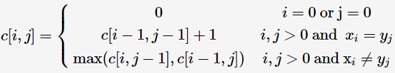

## Algorithms

### 最短路径算法Dijkstra总结

##### 最短路径数

```C++
// 最短路径条数
vector<int> pathCnt(N);
pathCnt[S] = 1;
// in loop
if(d[u] + e[u][v] < d[v]) {
    pathCnt[v] = pathCnt[u];
}
else if(d[u] + e[u][v] == d[v]) {
    pathCnt[v] += pathCnt[u];
}
```

##### 保存所有最短路径

```c++
// 记录的是前驱
vector<vector<int> > path(N);
// in loop
if(d[u] + e[u][v] < d[v]) {
    path[v].clear();
    path.push_back(u);
}
else if(d[u] + e[u][v] == d[v]) {
    path.push_back(u);
}
```


##### 点带权

* 增加相应判断即可，PAT1003
* PAT1018也是点带权，但是判断方式不满足最优子结构，需要得到所有路径后，遍历选出最优

##### 边带权

* 增加相应判断即可，PAT1030

### 二分法

* PAT 1010
* PAT 1044
* PAT 1048，题中要求exact，所以可以调用binary_search
* `< ` 和 `<=`的区别就是lower_bound和upper_bound的区别

```c++
int left = 0, right = N, l, r;
while(left < right) {
  int mid = (left + right) / 2;
  if(v[mid] < val)
    left = mid + 1;
  else right = mid;
  l = left;// find the first >= val
}
left = 0; right = v1.size();
while(left < right) {
  int mid = (left + right) / 2;
  if(v[mid] <= val) 
    left = mid + 1;
  else right = mid;
  r = left;// left is the pos of the first key > val
}
```

### LCS

* sub-string必须是连续的PAT 1040

  $C[i][j] = C[i == 0?0:i-1][j ==0?0:j-1] + 1\quad when\quad s1[i]==s2[j]$

  $C[i][j] = 0\quad when \quad s1[i]\neq s2[j]$

* sub-sequence符合顺序即可

  

* sub-sequence循序重复PAT 1045

  $C[i][j] = max(C[i][j-1], C[i-1][j])\quad when\quad s1[i] \neq s2[j]$

  $C[i][j] = max(C[i][j-1], C[i-1][j])+1\quad when\quad s1[i] = s2[j]$

### Tree Traversals

```c++
vector<int> in;
vector<int> pre;
vector<int> post;
vector<int> level;
```

* post + in TO level

```c++
// to_level(0, N-1, 0, N-1) to invoke
void to_level(int idx, int root, int left, int right) {
    if(left > right) return;
    level[idx] = post[root];
    int i;
    for(i = left; i < right; i++) {
        if(in[i] == post[root]) break;
    }
    to_level(2*idx+1, root - (right - i + 1), left, i - 1);// left
    to_level(2*idx+2, root - 1, i + 1, right);// right
}
```

* post + in TO pre

```c++
// to_pre(N-1, 0, N-1)
void to_pre(int root, int left, int right) {
    if(left > right) return;
    pre.push_back(post[root]);
    int i;
    for(i = left; i < right; i++) 
        if(in[i] == post[root]) break;
    to_pre(root - (right - i + 1), left, i - 1);
    to_pre(root - 1, i + 1, right);
}
```

* pre + in TO post

```c++
// to_post(0, 0, N-1);
void to_post(int root, int left, int right) {
    if(left > right) return;
    level[idx] = pre[root];
    int i;
    for(i = left; i < right; i++) 
        if(in[i] == pre[root]) break;
    to_post(2*idx + 1, root + 1, left, i - 1);
    to_post(2*idx + 2, root + (i - left + 1), i + 1, right);
}
```

* pre + in TO level

```c++
void to_level(int idx, int root, int left, int right) {
    if(left > right) return;
    post.insert(post.begin(), pre[root]);
    int i;
    for(i = left; i < right; i++) 
        if(in[i] == pre[root]) break;
    to_level(root + (i - left + 1), i + 1, right);
    to_level(root + 1, left, i - 1);
}
```


## Others

1. 循环中不能以变化的长度作为判断跳出条件
2. 当一个数很大的时候，要增加<0的判断，因为可能会溢出，如PAT1010
3. 有向图遍历每条边PAT1034